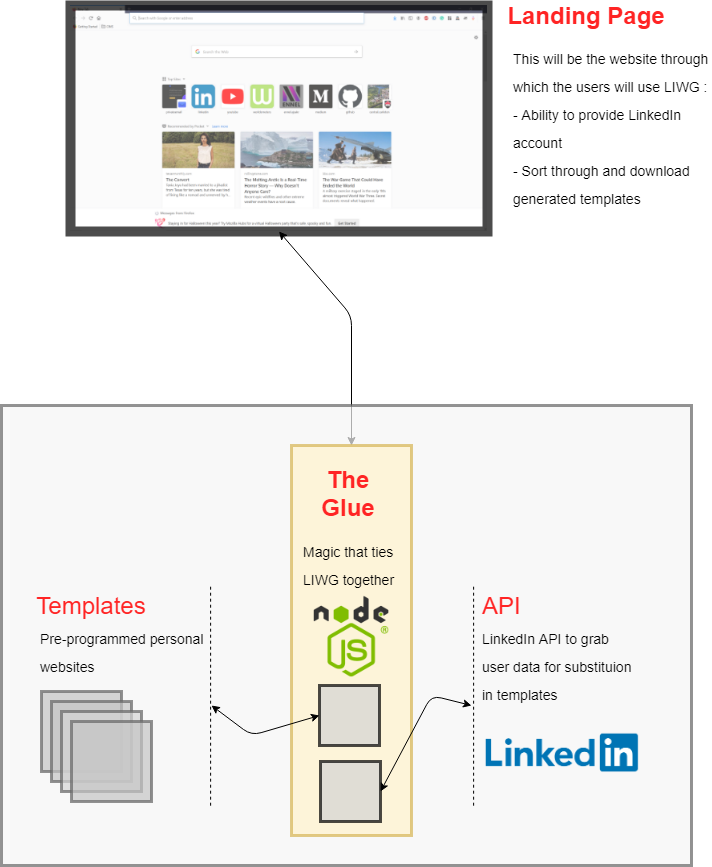

LIWG (LinkedIn Website Generator)
===

LIWG is a tool to generate personal websites from a variety of templates using your LinkedIn data. The intent
of the project is to provide you with a good personal website that is easily configurable, ultimately saving
you lots of time from having to start from scratch.

Proposed Architecture
---

LIWG is intended to be composed of 4 distinct components. The following is a Draw.io depiction of the components and a summary of their function.

